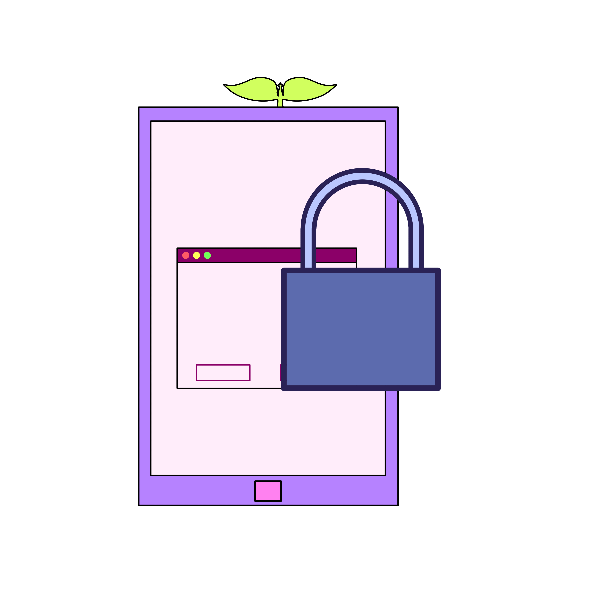
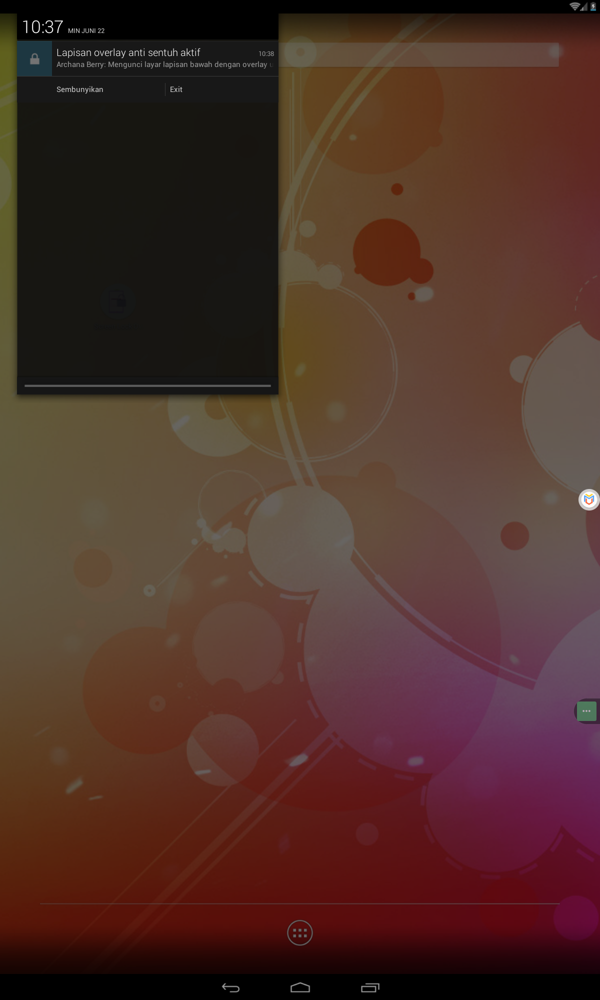
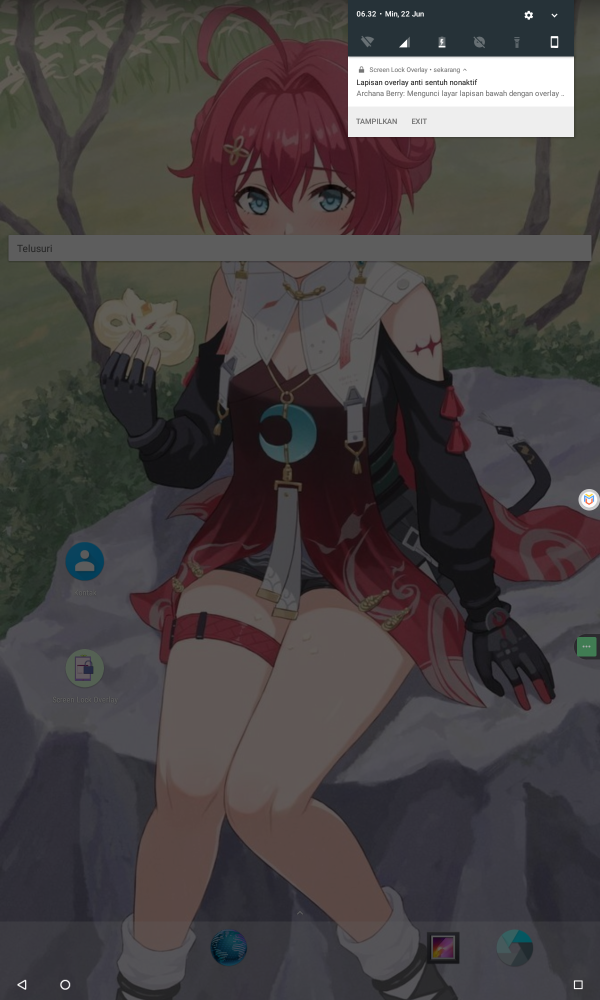
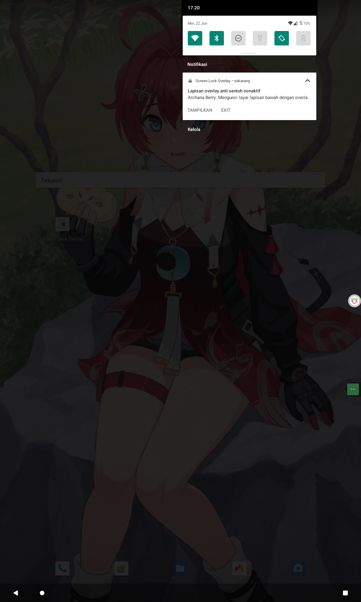
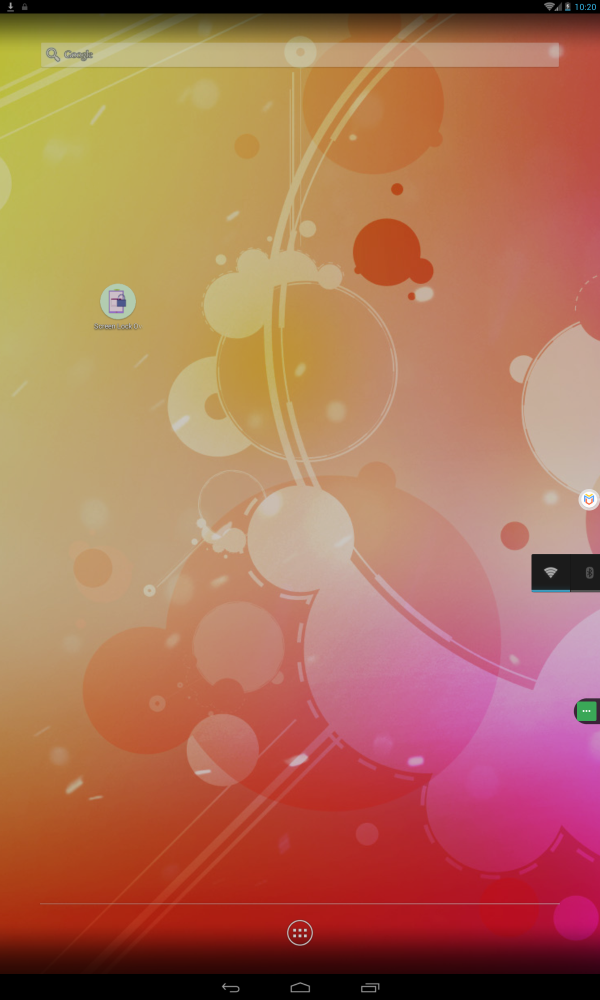
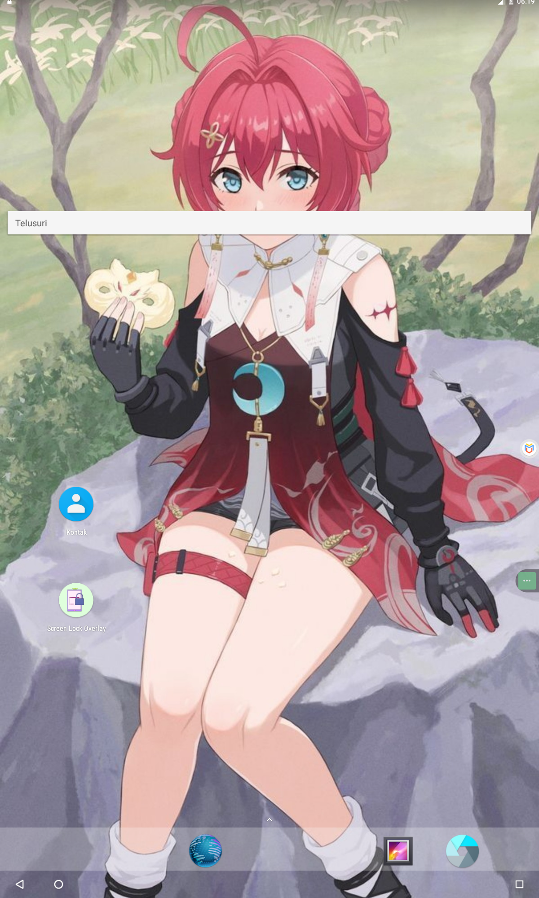

# ScreenLock-Overlay
My free app and source code to implement and test an overlay-based touchscreen lock, built for the Blueberry Lowbush environment ✨🌱🫐

---

## Overview


**ScreenLock-Overlay** is a lightweight Android app (API 16–34) that:

- Displays a **full-screen, semi-transparent** overlay (20% black)  
- **Blocks all touch events** to underlying apps  
- Hides system UI (status bar, navigation bar, “pony cutoff”) in immersive sticky mode  
- Runs as a **foreground service** with an ongoing, silent notification  
- Provides **toggle** and **exit** actions directly from the notification  
- Automatically ignores battery optimizations and stays running in the background  

It works seamlessly on **legacy Android 4.x tablets** up through **modern Android 16** (preview), handling all required runtime permissions.

---

## Features

- **One-tap activation**: Launch the app → grant overlay & notification permissions → overlay appears immediately  
- **Notification controls**:
  - **Show/Hide** overlay toggle  
  - **Exit** to stop the service and remove the overlay  
- **Transparent theme**: Activity is translucent; you never see a full-screen UI besides the overlay itself  
- **Backward-compatible**: Uses `TYPE_SYSTEM_ALERT` on older OS and `TYPE_APPLICATION_OVERLAY` on Android 8.0+  
- **Battery-friendly**: Requests “ignore battery optimizations” so it’s rarely killed  

---

## Screenshots

| Android 4 (API 16)         | Android 7 (API 24)        | Android 11 (API 30)       |
|----------------------------|---------------------------|---------------------------|
|  |  |  |
|  |  |  |

> *This is using Virtual Machine such as "Virtual Masger.apk" for stimulate app backward compatibility...*

---

## Installation

1. Clone or download this repository:  
   ```bash
   git clone https://github.com/archanaberry/screenlock-overlay.git
